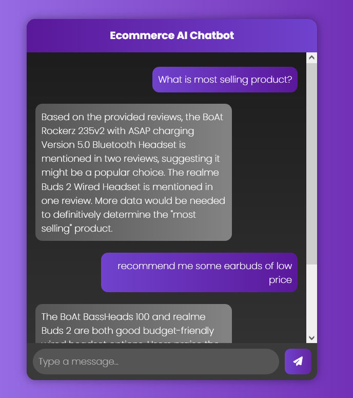

# Ecommerce AI Chatbot using AstraDB & LangChain



## 🚀 Overview
The **Ecommerce AI Chatbot** is a smart assistant designed to enhance customer experience in e-commerce platforms. It leverages **AstraDB, LangChain, and Google Generative AI** to provide intelligent product recommendations, answer customer queries, and improve engagement.

## 📌 Features
- 🛒 **Product Recommendations** – Suggests products based on queries.
- 💬 **Conversational AI** – Provides human-like interactions.
- 🔍 **Search & Retrieve** – Uses vector search with AstraDB.
- 📊 **Context-Aware Responses** – Generates answers based on product details and reviews.
- 🎨 **User-Friendly UI** – Chat interface with a modern look.

## 🏗️ Tech Stack
- **Backend:** Flask, LangChain, Google Generative AI
- **Database:** AstraDB (Vector Search)
- **Frontend:** HTML, CSS, JavaScript, Bootstrap
- **APIs:** Google Generative AI for embeddings & chatbot logic

## ⚡ Installation & Setup
### Prerequisites
- Python 3.8+
- AstraDB Account
- Google Generative AI API Key
- Virtual Environment (Optional but recommended)

### Steps
1. **Clone the Repository**
   ```sh
   git clone https://github.com/Abs-Futy7/Ecommerce-Chatbot-using-AstraDB-Langchain.git
   cd Ecommerce-Chatbot-using-AstraDB-Langchain
   ```

2. **Create a Virtual Environment & Install Dependencies**
   ```sh
   python -m venv venv
   source venv/bin/activate  # On Windows use: venv\Scripts\activate
   pip install -r requirements.txt
   ```

3. **Set Up Environment Variables**
   Create a `.env` file and add the following:
   ```sh
   GEMINI_API_KEY=your_google_api_key
   ASTRA_DB_APPLICATION_TOKEN=your_astra_db_token
   ASTRA_DB_API_ENDPOINT=your_astra_db_endpoint
   ```

4. **Run the Application**
   ```sh
   python app.py
   ```

5. **Access the Chatbot**
   Open your browser and visit: [http://127.0.0.1:5000](http://127.0.0.1:5000)


## ✨ Future Enhancements
- ✅ Multi-language support
- ✅ Voice-based interaction
- ✅ More advanced product filtering
- ✅ Integration with e-commerce platforms

## 📜 License
This project is licensed under the **MIT License**.

## 🤝 Contributing
Feel free to open issues, fork the repo, and submit PRs. Contributions are welcome! 🎉

## 📞 Contact
For any queries, reach out via **[GitHub Issues](https://github.com/Abs-Futy7/Ecommerce-Chatbot-using-AstraDB-Langchain/issues)**.
